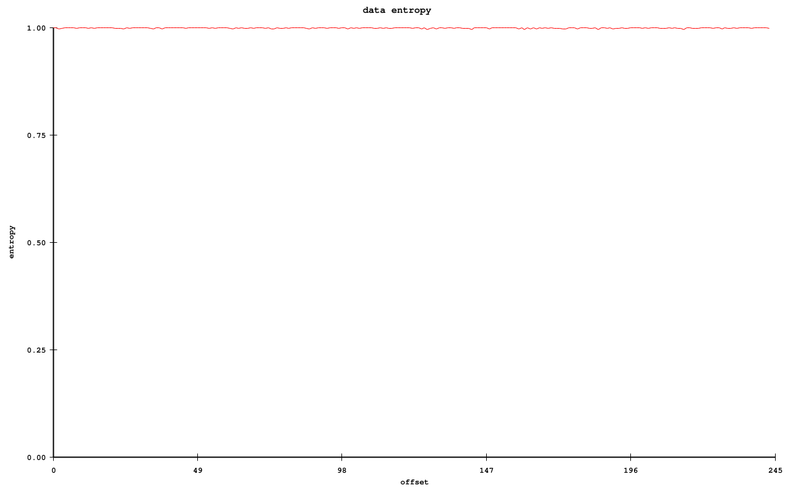

## d2bist

CLI utility to handle data as binary strings

The need behind it is to have a quick way to visualize programs as binary string while playing around with [AIT](https://en.wikipedia.org/wiki/Algorithmic_information_theory)

- Convert data to a binary string of `0` and `1`
- Statistical analysis of `0` and `1` distributions
    - Number of bit string of variable length (`0, 00, 000, 0000, 1, 11, 111, 1111` and so on)
- Visualize binary string as image
- Support online compression and decompression

### Examples

Analyze the first [1M bits](https://gist.github.com/fedemengo/bb99f9cb5a8491092e3d749a7b5910fa) of PI and generating an image

```
curl https://gist.githubusercontent.com/fedemengo/bb99f9cb5a8491092e3d749a7b5910fa/raw/5b0fd1d3ba5f4f4cda41bfad02d598a4ca276ae6/pi_b2_1M_mathematica 2>/dev/null | tail -c1000000 | d2bist encode -s -png pi >/dev/null

bits: 1000000

0: 500279 - 0.50028 %
1: 499721 - 0.49972 %

00: 250481 - 0.25048 %
01: 249798 - 0.24980 %
10: 249797 - 0.24980 %
11: 249923 - 0.24992 %

000: 125313 - 0.12531 %
001: 125168 - 0.12517 %
010: 124661 - 0.12466 %
011: 125136 - 0.12514 %
100: 125167 - 0.12517 %
101: 124630 - 0.12463 %
110: 125136 - 0.12514 %
111: 124787 - 0.12479 %
```


Plot the entropy of PI calculated on chunks of 4096 bits with symbols of 16 bits



Checkout other usage [examples](https://github.com/fedemengo/d2bist/tree/main/examples)

