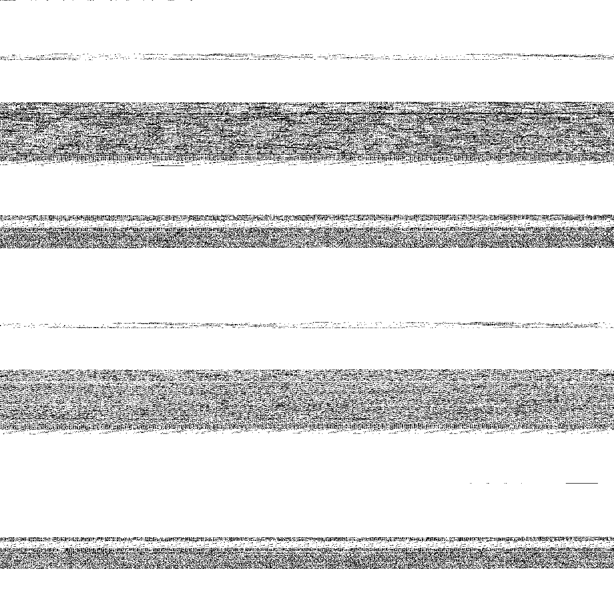
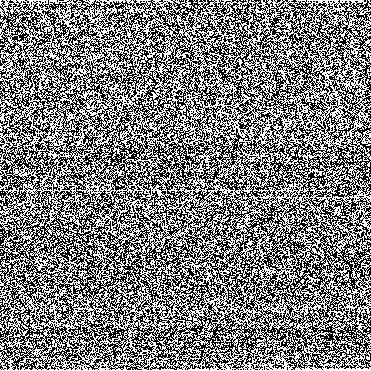

## f2bist

CLI utility to handle data as binary strings

The need behind it is to have a quick way to visualize programs as binary string while playing around with [AIT](https://en.wikipedia.org/wiki/Algorithmic_information_theory)

- Convert data to a binary string of `0` and `1`
- Statistical analysis of `0` and `1` distributions
    - Number of bit string of variable length (`0, 00, 000, 0000, 1, 11, 111, 1111` and so on)
- Visualize binary string as image

### Examples

#### Convert data to bin string

```
> echo "random text to png" | f2bist decode -utf8
01110010011000010110111001100100011011110110110100100000011101000110010101111000011101000010000001110100011011110010000001110000011011100110011100001010
```

#### Convert bin string to data

```
> echo "01110010011000010110111001100100011011110110110100100000011101000110010101111000011101000010000001110100011011110010000001110000011011100110011100001010" | f2bist encode | xargs echo
random text to png
```

#### Convert data to bin string and bin string back to data

```
> echo "random text to png" | f2bist decode -utf8 | f2bist encode | xargs echo
random text to png
```

#### Convert data to png

Given the data `random text to png`, its binary representation as image


```
> echo "random text to png" | f2bist decode -stats -utf8 -png text.png
01110010011000010110111001100100011011110110110100100000011101000110010101111000011101000010000001110100011011110010000001110000011011100110011100001010

bits: 152

0: 82
1: 70

l01: 0:        16 - 1:        14 | ratio: 1.14286
l02: 0:         9 - 1:        10 | ratio: 0.90000
l03: 0:         3 - 1:         8 | ratio: 0.37500
l04: 0:         4 - 1:         3 | ratio: 1.33333
l05: 0:         1 - 1:         0 | ratio: +Inf
l06: 0:         3 - 1:         0 | ratio: +Inf
```


On the other hand, this is what `/bin/ls` looks like



```
bits: 1496320

0: 1323269
1: 173051

l01: 0:     36736 - 1:     49860 | ratio: 0.73678
l02: 0:     19208 - 1:     19161 | ratio: 1.00245
l03: 0:     11001 - 1:      9333 | ratio: 1.17872
l04: 0:      4697 - 1:      3970 | ratio: 1.18312
l05: 0:      3539 - 1:      3133 | ratio: 1.12959
l06: 0:      2404 - 1:       604 | ratio: 3.98013
l07: 0:      2008 - 1:       615 | ratio: 3.26504
l08: 0:      1622 - 1:       266 | ratio: 6.09774
l09: 0:       923 - 1:       175 | ratio: 5.27429
l10: 0:       810 - 1:        76 | ratio: 10.65789
```

and this is what `/bin/ls` looks like once compressed with zip



```
bits: 271912

0: 133357
1: 138555

l01: 0:     34044 - 1:     32450 | ratio: 1.04912
l02: 0:     16429 - 1:     16629 | ratio: 0.98797
l03: 0:      8401 - 1:      8643 | ratio: 0.97200
l04: 0:      3943 - 1:      4471 | ratio: 0.88191
l05: 0:      2126 - 1:      2358 | ratio: 0.90161
l06: 0:      1024 - 1:      1284 | ratio: 0.79751
l07: 0:       619 - 1:       634 | ratio: 0.97634
l08: 0:       225 - 1:       292 | ratio: 0.77055
l09: 0:       113 - 1:       124 | ratio: 0.91129
l10: 0:        43 - 1:        82 | ratio: 0.52439
```

