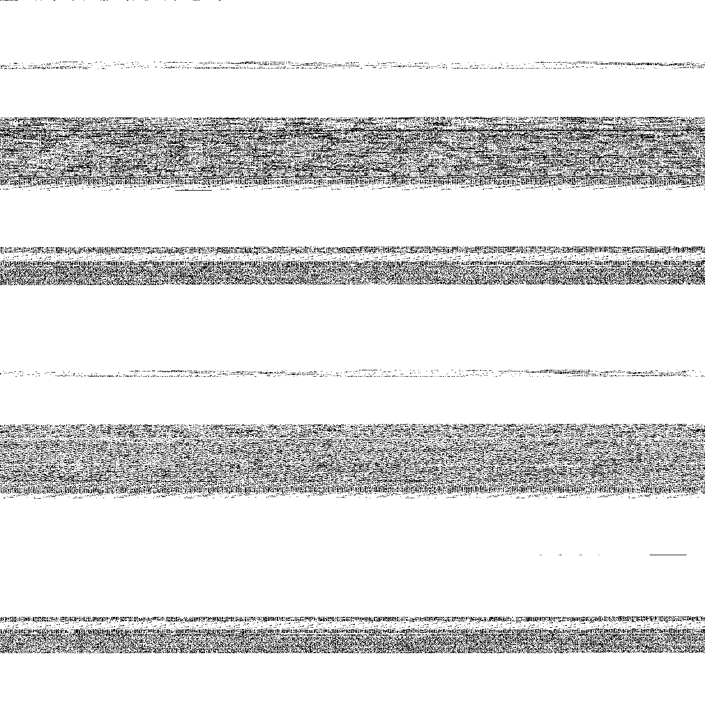
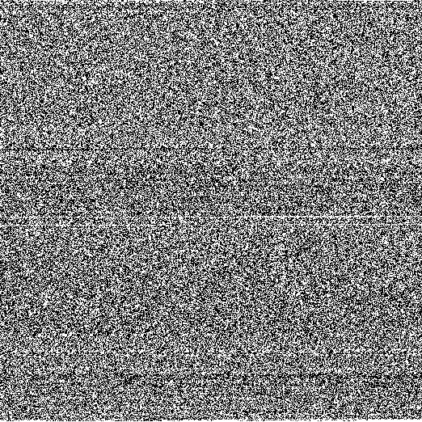

## Examples

### CLI usage

#### Convert data to bin string

```
> echo "random text to png" | d2bist decode -str
01110010011000010110111001100100011011110110110100100000011101000110010101111000011101000010000001110100011011110010000001110000011011100110011100001010
```

#### Convert bin string to data

```
> echo "01110010011000010110111001100100011011110110110100100000011101000110010101111000011101000010000001110100011011110010000001110000011011100110011100001010" | d2bist encode | xargs echo
random text to png
```

#### Convert data to bin string and bin string back to data

```
> echo "random text to png" | d2bist decode -str | d2bist encode | xargs echo
random text to png
```

#### Convert data to png

Given the data `random text to png`, its binary representation as image


```
> echo "random text to png" | d2bist decode -s -str -png text.png
01110010011000010110111001100100011011110110110100100000011101000110010101111000011101000010000001110100011011110010000001110000011011100110011100001010

bits: 152

0: 82 - 0.539 %
1: 70 - 0.461 %
```


On the other hand, this is what `/bin/ls` looks like



```
bits: 1496320

0: 1323269 - 0.884 %
1:  173051 - 0.116 %
```

and this is what `/bin/ls` looks like once compressed with gzip



```
bits: 278536

0: 137601 - 0.494 %
1: 140935 - 0.506 %
```

#### Compare compression algorithm

Starting from 5000 bits from `ripgrep`

```
> d2bist -rcap 5000 decode /usr/local/bin/rg | cat | d2bist decode -s -str 2>&1 >/dev/null | sed -n '2p'
bits: 5000
```

Zip compresses this particular piece of data to about `59%` of its original size

```
> d2bist -rcap 5000 decode /usr/local/bin/rg | zip 2>/dev/null | d2bist decode -s -str 2>&1 1>/dev/null | sed -n '2p'
bits: 2976
```

Gzip compresses this particular piece of data to about `39%` of its original size

```
> d2bist -rcap 5000 decode /usr/local/bin/rg | gzip | d2bist decode -s -str 2>&1 >/dev/null | sed -n '2p'
bits: 1968
```

Brotli compresses this particular piece of data to about `32-57%` of its original size, depending on the compression level

```
> d2bist -rcap 5000 decode /usr/local/bin/rg | brotli -q 0 | d2bist decode -s -str 2>&1 >/dev/null | sed -n '2p'
bits: 2896
```

```
> d2bist -rcap 5000 decode /usr/local/bin/rg | brotli -q 11 | d2bist decode -s -str 2>&1 >/dev/null | sed -n '2p'
bits: 1696
```

#### Testing compression internally

[Supported](https://github.com/fedemengo/d2bist/blob/c038b1b101c3a2839b423e552ecd1823aae0b895/internal/flags/parse.go#L32) compression algorithms

```
> d2bist -rcap 5000 decode -s -c b /usr/local/bin/rg >/dev/null
bits: 5000

0: 4252 - 0.850 %
1:  748 - 0.150 %

00: 3844 - 0.769 %
01:  407 - 0.081 %
10:  408 - 0.082 %
11:  340 - 0.068 %

compression ratio: 66.080
compression algorithm: Brotli

bits: 1696

0: 891 - 0.525 %
1: 805 - 0.475 %

00: 489 - 0.288 %
01: 401 - 0.237 %
10: 401 - 0.237 %
11: 404 - 0.238 %
```

Starting from `10000` pseudo random bytes different compression algorithms produce different results

```
> dd if=/dev/urandom bs=1 count=10000 2>/dev/null > 10000b-rand
```

```
> cat 10000b-rand | d2bist decode -s >/dev/null

bits: 80000

0: 40191
1: 39809


> cat 10000b-rand | d2bist decode -c b -s >/dev/null

bits: 80000

0: 40191
1: 39809

compression ratio: -0.040
compression algorithm: Brotli

bits: 80032

0: 40209
1: 39823

> cat 10000b-rand | d2bist decode -c s2 -s >/dev/null

bits: 80000

0: 40191
1: 39809

compression ratio: -0.180
compression algorithm: S2

bits: 80144

0: 40276
1: 39868
```

In random data, there is no structure that can be compressed to a simpler representation. On the other hand, compressing hamlet as `.txt` file is much more satisfying

```
> d2bist decode -s -c b hamlet.txt >/dev/null

bits: 1554696

0: 906313
1: 648383

compression ratio: 67.692
compression algorithm: Brotli

bits: 502296

0: 249800
1: 252496

> d2bist decode -s -c zstd hamlet.txt >/dev/null

bits: 1554344

0: 906115
1: 648229

compression ratio: 61.564
compression algorithm: Zstd

bits: 597424

0: 304010
1: 293414
```

#### Data integrity

To test the decoding/encoding don't alter the data I usually

```
> d2bist decode -str hamlet.txt | d2bist encode | diff hamlet.txt - ; echo $?
0
```

with compression

```
> d2bist decode -str -c b hamlet.txt | d2bist -c b encode >/dev/null | diff hamlet.txt - ; echo $?
0
```

